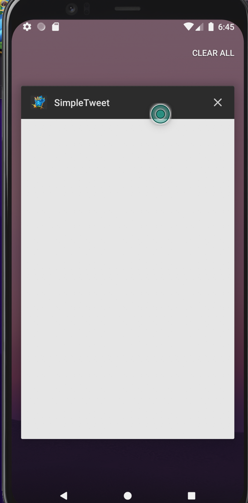

# SimpleTwitter

simple android twitter app

## PART 2

### Extra Features implemented Part 2

- Improve the user interface and theme the app to feel "twitter branded"

- User can open the twitter app offline and see last loaded tweets (2 points)

- Added counter to textEdit

## PART 1

### Extra Features implemented

- User can view more tweets as they scroll with infinite pagination

- Improve the user interface and theme the app to feel "twitter branded"

added twitter icon and changed the color of the log in button and text header of each tweet

